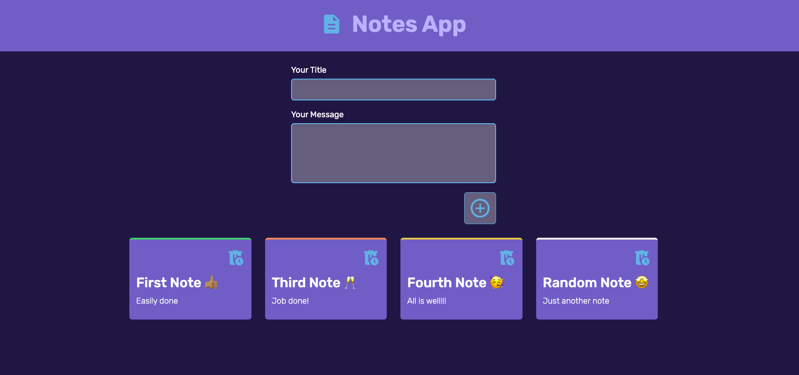

# Notes App

Welcome to the Notes App, a simple and intuitive application for adding, deleting, and managing notes. This project was built using React and Vite, with a focus on clean design and responsive functionality.

## Live Demo

Check out the live demo of the Notes App [here](https://victorkevz.github.io/Notes-App/).

## Features

- **Add Notes**: Easily add new notes with a title and message.
- **Delete Notes**: Remove notes with a single click.
- **Form Validation**: Prevent submission of empty notes and display error messages when the title or message is missing.
- **Hover Effects**: Enjoy smooth hover effects with card scaling from 1 to 1.1.
- **Responsive Design**: The app is fully responsive, thanks to CSS Grid, ensuring a seamless experience on any device.

## Technologies Used

- **HTML**
- **CSS**
- **ReactJS**
- **Vite**

## Getting Started

To get a local copy of the Notes App up and running, follow these simple steps.

### Prerequisites

Make sure you have the following installed on your machine:

- Node.js (version 12 or higher)
- npm (version 6 or higher) or yarn

### Installation

1. Clone the repository:

    ```sh
    git clone https://github.com/VictorKevz/Notes-App.git
    ```

2. Navigate to the project directory:

    ```sh
    cd Notes-App
    ```

3. Install the dependencies:

    ```sh
    npm install
    ```

    or if you are using yarn:

    ```sh
    yarn install
    ```

### Running the App

To start the development server and run the app locally:

```sh
npm run dev
```

or if you are using yarn:

```sh
yarn dev
```

The app will be available at `http://localhost:5173`.

### Building for Production

To build the app for production:

```sh
npm run build
```

or if you are using yarn:

```sh
yarn build
```

The build files will be generated in the `dist` directory.

## Project Structure

The project structure is as follows:

```
Notes-App/
├── public/
│   ├── index.html
│   └── ...
├── src/
│   ├── assets/
│   │   ├── add.svg
│   │   ├── delete-icon.svg
│   │   └── error-icon.svg
│   ├── components/
│   │   ├── Form/
│   │   │   ├── Form.js
│   │   │   └── form.css
│   │   ├── Notes/
│   │   │   ├── Notes.js
│   │   │   └── notes.css
│   ├── App.js
│   ├── index.js
│   └── ...
├── .gitignore
├── package.json
└── README.md
```

## Contributing

Contributions are welcome! If you have any suggestions, bug reports, or feature requests, please open an issue or submit a pull request.


## Acknowledgements

- Thanks to the open-source community for providing invaluable resources and inspiration.
- Special thanks to the developers behind React and Vite for their amazing tools.

---


Happy coding!
```
